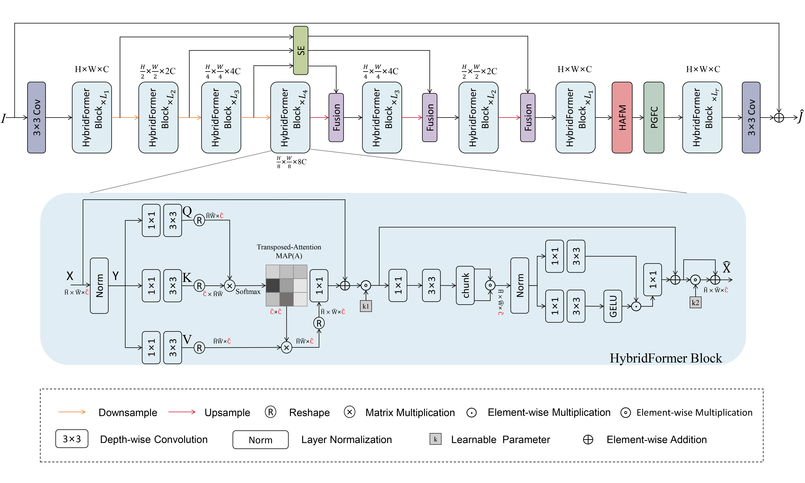
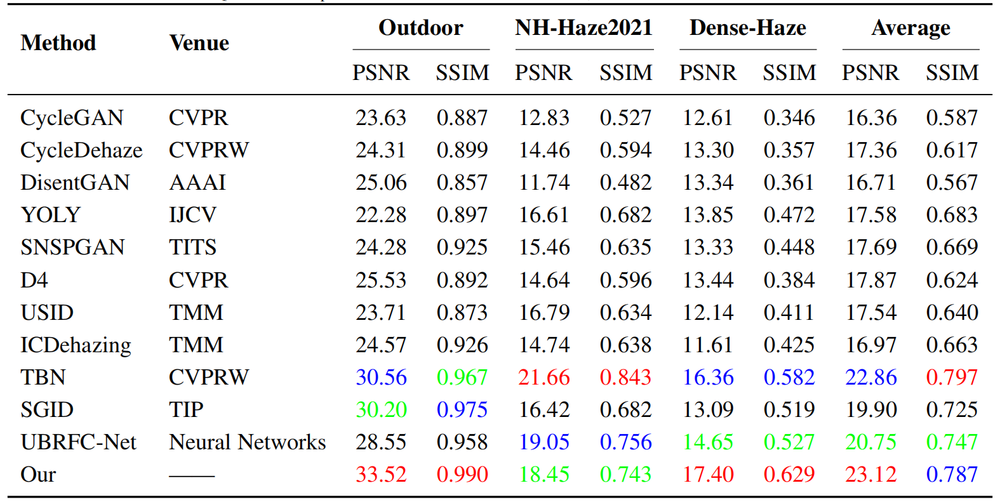

# MSAFFormer: A Multi-Scale Attention Fusion Transformer for Single Image Dehazing

[Tongwang Zhang], [Dongli Jia]


<hr />

> **Abstract:** *The single image dehazing problem remains challenging due to the complex and spatially varying degradation caused by atmospheric scattering, especially under conditions of dense or non-uniform haze. In this work, we propose MSAFFormer, a novel end-to-end hybrid Transformer framework that integrates multi-scale attention fusion with physically guided feature refinement. By combining convolutional inductive bias with global self-attention, the model effectively captures both local texture details and long-range dependencies. To further enhance haze-related representation learning, we introduce the Haze-Aware Feature Modulator (HAFM), which adaptively reweights spatial-channel features using a transmission-aware gating mechanism and high-frequency enhancement. In addition, a Physics-Guided Feature Correction (PGFC) module embeds a differentiable atmospheric scattering prior into the deep feature space, providing directional correction in heavily degraded regions while maintaining physical consistency. Extensive experiments demonstrate that our method outperforms numerous state-of-the-art approaches across multiple image dehazing datasets.*
<hr />

## Network Architecture



## Datasets
<table>
<thead>
  <tr>
    <th>Dataset</th>
    <th>Outdoor</th>
    <th>NTIRE</th>
    <th>Haze1k</th>

  </tr>
</thead>
<tbody>
  <tr>
    <td>Baidu Cloud</td>
    <td> <a href="https://pan.baidu.com/s/1owpaqVo38W4FcS_rVvKJIw">Download (2xph)</a> </td>
    <td> <a href="https://pan.baidu.com/s/1RbjG7gw8z3a8L0fRFoAavw">Download (frde)</a> </td>
    <td> <a href="https://pan.baidu.com/s/1ICUpWsPLrgag7zlgnCXZmA">Download (ckek)</a> </td>
  </tr>
</tbody>
</table>
Here, these datasets we provided are fully paired images.

## Training
1. Please download the corresponding training datasets and put them in the folder `Datasets/train`. Download the testing datasets and put them in the folder `Datasets/test`.
2. Follow the instructions below to begin training our model.
```
cd MSAFFormer
bash train.sh
```
Run the script then you can find the generated experimental logs in the folder `experiments`.

## Testing
1. Please download the corresponding testing datasets and put them in the folder `test/input`. Download the corresponding pre-trained models and put them in the folder `pretrained_models`.
2. Follow the instructions below to begin testing our model.
```
python test.py --task Deraining --input_dir './test/input/' --result_dir './test/output/'
```
Run the script then you can find the output visual results in the folder `experiments`.

## Pre-trained Models
<table>
<thead>
  <tr>
    <th>Dataset</th>
    <th>Outdoor</th>
    <th>NH-HAZE</th>
    <th>Dense_Haze</th>
    <th>Haze1k_moderate</th>
    <th>Haze1k_thick</th>
    <th>Haze1k_thin</th>
  </tr>
</thead>
<tbody>
  <tr>
    <td>Baidu Cloud</td>
    <td> <a href="https://pan.baidu.com/s/1KT8C7lyXie1_WIxbp5EpAw">Download (bbfj)</a>  </td>
    <td> <a href="https://pan.baidu.com/s/1WH8_1kdBaGJIiMLHvzygRQ">Download (9iik)</a>  </td>
    <td> <a href="https://pan.baidu.com/s/1usIk5u-PKQntc-NWlcgLog">Download (b6bt)</a>  </td>
    <td> <a href="https://pan.baidu.com/s/1VaW93hizH7nBU-zjkaIpVg">Download (7snn)</a>  </td>
    <td> <a href="https://pan.baidu.com/s/1l94n3zrmP8TdPLHu_4N6-w">Download (tmrm)</a>  </td>
    <td> <a href="https://pan.baidu.com/s/1JBoe7uprT3TsPBDiMUbL0g">Download (ujq5)</a>  </td>
  </tr>
</tbody>

</table>

## Performance Evaluation
See document "[evaluate_PSNR_SSIM.m](evaluate_PSNR_SSIM.m)" 




## Acknowledgment
This code is based on the [Restormer](https://github.com/swz30/Restormer). Thanks for their awesome work.


